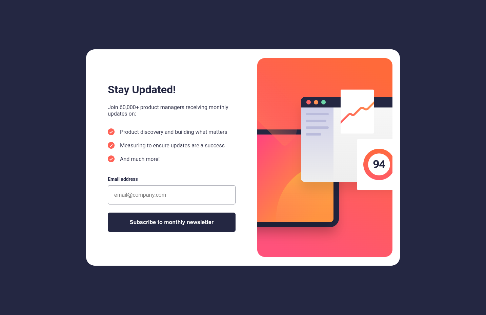

# Frontend Mentor - Newsletter sign-up form with success message solution

This is a solution to the [Newsletter sign-up form with success message challenge on Frontend Mentor](https://www.frontendmentor.io/challenges/newsletter-signup-form-with-success-message-3FC1AZbNrv). Frontend Mentor challenges help you improve your coding skills by building realistic projects.

## Table of contents

- [Overview](#overview)
  - [The challenge](#the-challenge)
  - [Screenshot](#screenshot)
  - [Links](#links)
- [My process](#my-process)
  - [Built with](#built-with)
  - [What I learned](#what-i-learned)
  - [Useful resources](#useful-resources)
- [Author](#author)

## Overview

### The challenge

Users should be able to:

- Add their email and submit the form
- See a success message with their email after successfully submitting the form
- See form validation messages if:
  - The field is left empty
  - The email address is not formatted correctly
- View the optimal layout for the interface depending on their device's screen size
- See hover and focus states for all interactive elements on the page

### Screenshot

### Links

- Solution URL: [Github Repo](https://github.com/barla-x88/fm-newsletter-signup)
- Live Site URL: [https://register-newsletter.netlify.app](https://register-newsletter.netlify.app/)

## My process

### Built with

- Semantic HTML5 markup
- CSS custom properties
- Flexbox
- [React](https://reactjs.org/) - JS library

### What I learned

- Adding custom validation message

### Useful resources

- [Providing custom error messages for built-in HTML5 form validation](https://angelika.me/2020/02/01/custom-error-messages-for-html5-form-validation/) - Set custom validation message for input elements.

- [Typical use cases of flexbox](https://developer.mozilla.org/en-US/docs/Web/CSS/CSS_flexible_box_layout/Typical_use_cases_of_flexbox) - Aligning content with flexbox

## Author

- Website - [Ankit Barla](https://ankit.free.nf)
- Frontend Mentor - [@barla-x88](https://www.frontendmentor.io/profile/barla-x88)
- Twitter - [@BarlaX88](https://twitter.com/BarlaX88)
